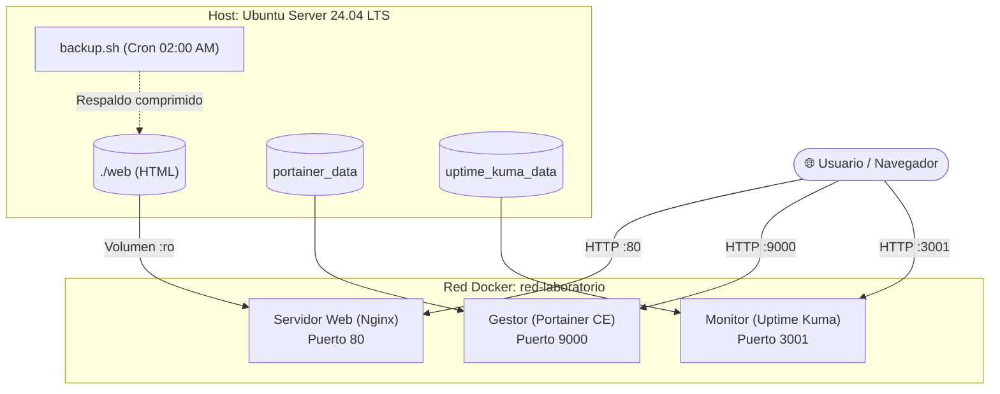

# 🚀 Laboratorio de Infraestructura y Servicios Contenedorizados


Despliegue de infraestructura ligera de servicios sobre **Ubuntu Server 24.04 LTS** utilizando **Docker Compose**, automatización de copias de seguridad con **Bash/Cron** y gestión bajo buenas prácticas de Git (Conventional Commits, Least Privilege).

---

## 🛠️ Servicios Desplegados

| Servicio | Tecnología | Puerto | Descripción |
| :--- | :--- | :--- | :--- |
| **Servidor Web** | Nginx (Alpine) | `80` | Landing page estática servida mediante volumen de solo lectura. |
| **Gestión Docker** | Portainer CE | `9000` | Interfaz gráfica para gestión y monitorización de contenedores. |
| **Observabilidad** | Uptime Kuma | `3001` | Panel de monitorización de disponibilidad y estado de servicios. |

---
## 🏗️ Arquitectura del Sistema


## ⚙️ Características Técnicas

* **Seguridad & Permisos:** Configuración de volúmenes en modo *read-only* (`:ro`) y ejecución de procesos bajo usuarios sin privilegios elevadores.
* **Automatización:** Script en Bash (`backup.sh`) para compresión de datos y rotación automática de copias de seguridad de más de 7 días.
* **Planificación:** Programación diaria a las 02:00 AM mediante el demonio `cron`.
* **Persistencia:** Volúmenes administrados por Docker para preservar datos de Portainer y Uptime Kuma.

---

## 🚀 Despliegue Rápido

```bash
# Clonar repositorio
git clone git@github.com:alvarodiazexposito/Laboratorio-Docker.git
cd Laboratorio-Docker

# Desplegar la pila de contenedores
docker compose up -d# Laboratorio-Docker
